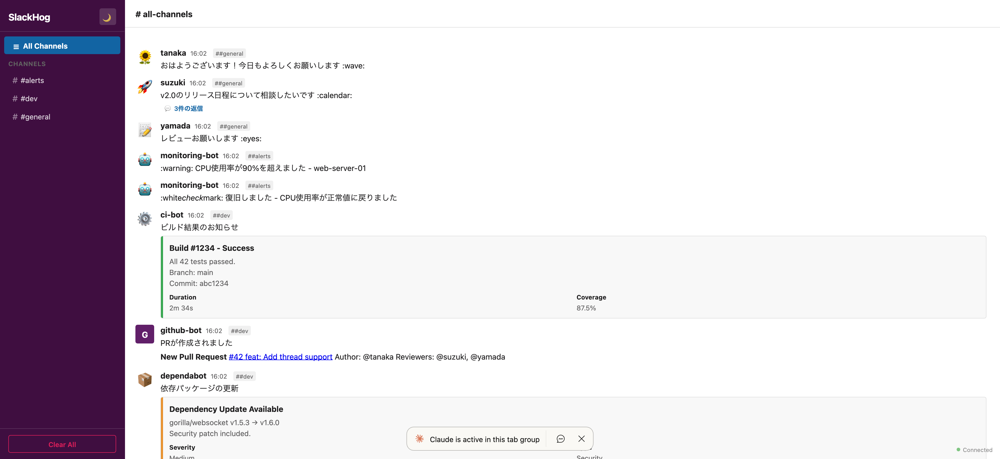
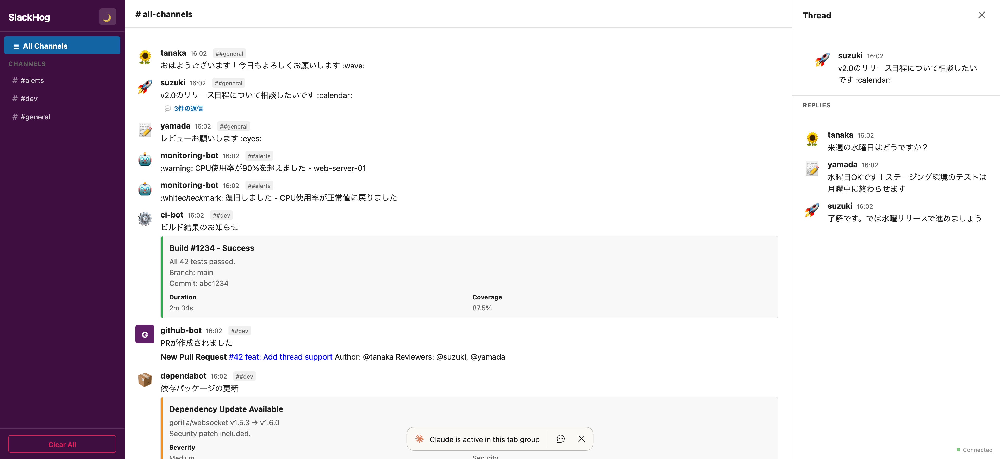
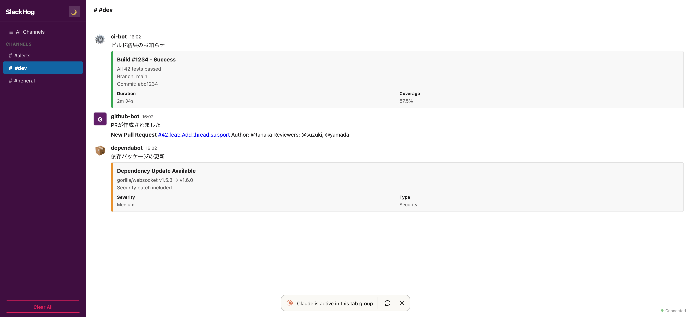
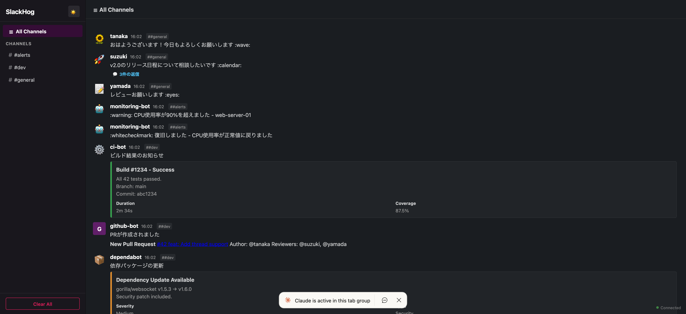

<p align="center">
  
</p>

<p align="center">
  <a href="https://github.com/harakeishi/slackhog/actions/workflows/ci.yml"></a>
  <a href="https://github.com/harakeishi/slackhog/releases/latest"></a>
  <a href="https://github.com/harakeishi/slackhog/pkgs/container/slackhog"></a>
  <a href="https://github.com/harakeishi/slackhog/blob/main/LICENSE"></a>
</p>

A [MailHog](https://github.com/mailhog/MailHog)-like tool for Slack. SlackHog catches Slack API requests locally and displays them in a Slack-like Web UI — useful for developing and testing Slack integrations without sending real messages.

## Screenshots

### Slack-like Web UI with channels and emoji avatars



### Thread support with side panel



### Rich messages (attachments, blocks, fields)



### Dark / Light theme



## Features

- **Slack API compatible** — supports `chat.postMessage`, `chat.update`, `conversations.info`, `conversations.list`, and Incoming Webhooks
- **Real-time Web UI** — Slack-like interface with channels, threads, and emoji avatars
- **WebSocket push** — messages appear instantly without polling
- **Thread support** — view threaded conversations in a side panel
- **Rich messages** — renders attachments (color bars, fields) and blocks (sections, actions, links)
- **Dark / Light theme** — toggle between themes
- **Config file support** — pre-register channels and set defaults via YAML/JSON config
- **In-memory store** — no database required, configurable message retention
- **Single binary** — UI is embedded via `go:embed`

## Quick Start

### Docker (recommended)

```bash
docker run -p 4112:4112 ghcr.io/harakeishi/slackhog
```

With a config file:

```bash
docker run -p 4112:4112 \
  -v ./slackhog.yaml:/etc/slackhog/config.yaml:ro \
  ghcr.io/harakeishi/slackhog -config /etc/slackhog/config.yaml
```

Or with Docker Compose:

```yaml
services:
  slackhog:
    image: ghcr.io/harakeishi/slackhog
    ports:
      - "4112:4112"
    volumes:
      - ./slackhog.yaml:/etc/slackhog/config.yaml:ro
    command: ["-config", "/etc/slackhog/config.yaml"]
```

### Go install

```bash
go install github.com/harakeishi/slackhog@latest
slackhog
```

### Build from source

```bash
git clone https://github.com/harakeishi/slackhog.git
cd slackhog
go build -o slackhog .
./slackhog
```

Open http://localhost:4112 to view the Web UI.

## Usage

```
slackhog [flags]

Flags:
  -config string     path to config file (YAML or JSON)
  -port int          listen port (overrides config, default 4112)
  -max-messages int  maximum number of messages to keep (overrides config, default 1000)
```

### Config File

You can use a YAML or JSON config file to pre-register channels and set defaults. Channels defined in the config appear in the UI on startup without needing any messages first.

```yaml
# slackhog.yaml
port: 4112
max_messages: 1000
channels:
  - general
  - random
  - alerts
```

```bash
slackhog -config slackhog.yaml
```

CLI flags override config file values when explicitly set. See [`slackhog.example.yaml`](slackhog.example.yaml) for a full example.

## API Endpoints

### Slack-compatible

| Method | Path | Description |
|--------|------|-------------|
| POST | `/api/chat.postMessage` | Slack `chat.postMessage` compatible endpoint |
| POST | `/api/chat.update` | Slack `chat.update` compatible endpoint |
| GET | `/api/conversations.info` | Slack `conversations.info` compatible endpoint |
| GET | `/api/conversations.list` | Slack `conversations.list` compatible endpoint |
| POST | `/services/{webhook_id}` | Incoming Webhook compatible endpoint |

### Internal

| Method | Path | Description |
|--------|------|-------------|
| GET | `/_api/messages` | List messages (optional `?channel=` filter) |
| DELETE | `/_api/messages` | Clear all messages |
| GET | `/_api/messages/{id}/replies` | Get thread replies |
| GET | `/ws` | WebSocket for real-time updates |

## Examples

Send a message via `chat.postMessage`:

```bash
curl -X POST http://localhost:4112/api/chat.postMessage \
  -H "Content-Type: application/json" \
  -d '{
    "channel": "#general",
    "text": "Hello from SlackHog!",
    "username": "test-bot",
    "icon_emoji": ":robot_face:"
  }'
```

Send a message via Incoming Webhook:

```bash
curl -X POST http://localhost:4112/services/T00000000/B00000000/XXXXXXXX \
  -H "Content-Type: application/json" \
  -d '{"text": "Webhook message!", "channel": "#alerts"}'
```

Update a message via `chat.update`:

```bash
# Use the `ts` value returned from chat.postMessage
curl -X POST http://localhost:4112/api/chat.update \
  -H "Content-Type: application/json" \
  -d '{
    "channel": "#general",
    "ts": "1234567890.123456",
    "text": "Updated message text"
  }'
```

List channels via `conversations.list`:

```bash
curl http://localhost:4112/api/conversations.list
```

Get channel info via `conversations.info`:

```bash
curl http://localhost:4112/api/conversations.info?channel=general
```

Send a threaded reply:

```bash
# First, send a parent message and note the returned `ts` value
# Then send a reply using that `ts` as thread_ts
curl -X POST http://localhost:4112/api/chat.postMessage \
  -H "Content-Type: application/json" \
  -d '{
    "channel": "#general",
    "text": "This is a reply",
    "thread_ts": "<ts-from-parent-message>"
  }'
```

Send a message with actions blocks:

```bash
curl -X POST http://localhost:4112/api/chat.postMessage \
  -H "Content-Type: application/json" \
  -d '{
    "channel": "#general",
    "text": "Approve this deploy?",
    "blocks": [
      {
        "type": "section",
        "text": {"type": "mrkdwn", "text": "Deploy *v1.2.3* to production?"}
      },
      {
        "type": "actions",
        "elements": [
          {"type": "button", "text": {"type": "plain_text", "text": "Approve"}, "style": "primary"},
          {"type": "button", "text": {"type": "plain_text", "text": "Reject"}, "style": "danger"}
        ]
      }
    ]
  }'
```

## Architecture

SlackHog follows SOLID principles with clear interface boundaries:

```
┌──────────────┐     ┌──────────────┐     ┌──────────────┐
│  Slack API   │     │ Internal API │     │  WebSocket   │
│  Handlers    │     │  Handlers    │     │     Hub      │
└──────┬───────┘     └──────┬───────┘     └──────┬───────┘
       │                    │                    │
       ▼                    ▼                    ▼
   SlackAPI            InternalAPI           WSHandler
  interface            interface             interface
       │                    │                    │
       └────────┬───────────┘                    │
                ▼                                │
          MessageStore ◄─────────────────────────┘
           interface
                │
                ▼
          MemoryStore
```

## License

See [LICENSE](LICENSE).
